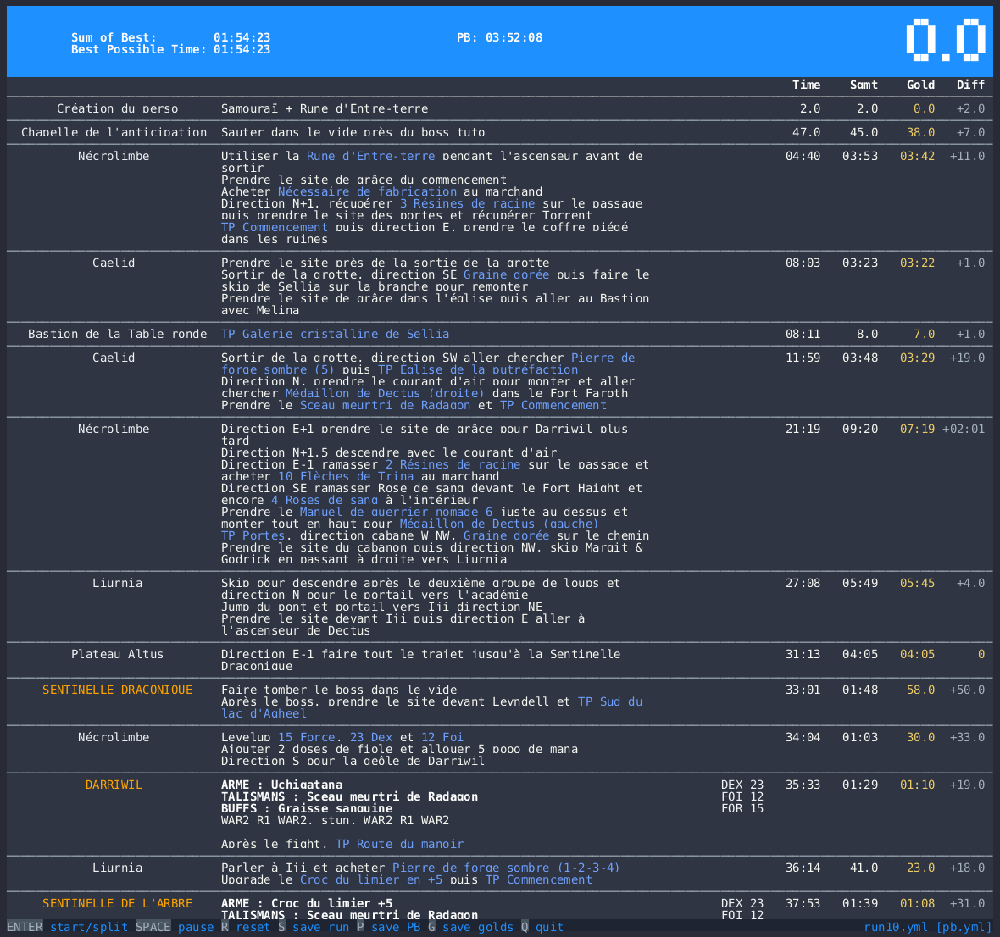

# OFF Split

Offsplit is a terminal speedrun splitter to use offline, i.e. you must split by yourself.



## Dependencies

```
pip install -r requirements.txt
```

## How to launch it

The files structure is:

```
routes/
    eldenring/
        route.any.glitchless.bhf.yml
runs/
    romain/
        any/
            pb.yml
            run1.yml
```

`runs/romain/any/` is a directory related to a route and where are saved my PB and my runs. I refer to it when I launch offsplit.

A runs directory always contain a file `pb.yml`, which is firstly empty, but will be erased by your runs. It refers the route.

Syntax to launch offsplit is:

`./offsplit.py RUNS_DIR [RUN_NAME]`

If the `RUNS_DIR` does not exist, offsplit will ask what route you want to follow:

```
$ ./offsplit.py runs/roger/eldenring/any
No runs in runs/roger/eldenring/any. Do you want to create it? (Y/n) y
 0 Elden Ring − Malenia% Glitchess BHF
 1 Elden Ring − Any% Glitchess BHF
What route do you want to use? 1
 pb         2023-05-08 12:58:36.427836
Enter name of the route, or new one to create it: run1
```

Then, you can use the same run directory, and supply the run name on the command line, or select one existing.

## Speedrun concepts

I guess you know this vocabulary if you are interested by this tool, but to remember:

* Segment: a route is divided into segments, and you split when you achieved a segment. That's useful to compare time of your current segment with one of your PB
* PB: Personal Best, the better run you did. It is stored in `pb.yml` in your run directory.
* Gold: the better time you did on a split.
* BTP: Best Possible Time, during a run, sum of the following segment golds.

## How to use it

In the application, you can use the following shortcuts:

* `ENTER`: starts the run, or split to the next segment
* `SPACE`: pause the run
* `r`: reset the run (can't be undone)
* `s`: save the run
* `p`: save the run in the file `pb.yml`
* `g`: save golds of this run in `pb.yml`
* `b`: resume the run (for example, if you saved the run, exited, and then reopen the run, you can use `b` to go back at the previous segment)
* `d`: show debug information
* `q`: quit

## Leaderboard

`leaderboard.py` is a script to see all runs by everybody.

Feel free to do PR to add your own runs!

## How to create routes

Routes are YAML files. There is no editor, but you can create them easily.

The structure is:

```yaml
game: str               # Name of the game
name: str               # Name of the route
route:
- id: str               # Unique identifier, are refered in runs files
  name: str             # Name of the segment
  color: str | null     # Optional, color of the segment (currently, 'null' or 'boss')
  description: str      # Description of the segment (for example what you have to do)
  build: list[str]      # Optional, list of equipment required for this segment
  stats: dict[str, str] # Optional, required stats
```

For example:

```yaml
game: Elden Ring
name: Any% Glitchess BHF
route:
- id: ea863e15-7edc-443b-ae3a-e15f6dfd5943
  name: RADAHN
  color: boss
  description: "Safe opener: go back until Radahn disapears, then go forward.\n JR1,\
    \ 3 R1, WA, 2 R1.\nAfter the fight, kill Alexander to get the |Warrior Jar Shard|, and |TP Stormhill Shack|"
  build:
  - 'WEAPON: BHF +5'
  - 'TALISMANS: Radagon's Soreseal'
  - "BUFFS: Golden Vow"
  stats:
    DEX: 23
    FOI: 12
    FOR: 15
```

Read existing routes to see complete examples.
